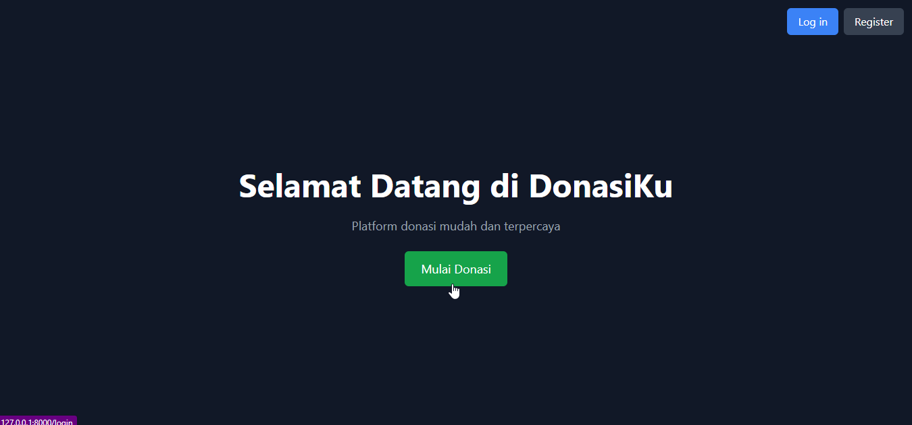
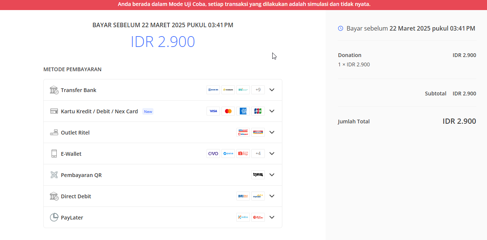

## About Project
This project, **donasiKu**, is a platform designed to simplify and enhance the process of managing donations. It provides an intuitive interface for donors and organizations to connect, ensuring transparency and efficiency in the donation process.

#### Dashboard page

### Features
- **User-Friendly Interface**: Easy navigation for both donors and organizations.
- **Secure Transactions**: Ensures all donations are processed securely.
- **Real-Time Updates**: Track donation progress and updates instantly.
- **Customizable Campaigns**: Organizations can create and manage donation campaigns tailored to their needs.
- **Comprehensive Reports**: Detailed analytics and reports for better decision-making.

#### Donation form page

### Technologies Used
- **Backend**: Laravel Framework
- **Frontend**: Blade Templates, Tailwind CSS
- **Database**: MySQL
- **APIs**: RESTful APIs for seamless integration

#### Payment with xendit

### Getting Started
To get started with the project, follow these steps:
1. Clone the repository: `git clone https://github.com/mfaishal82/donasiKu.git`
2. Install dependencies: `composer install && npm install`
3. Set up the environment file: `cp .env.example .env`
4. Generate application key: `php artisan key:generate`
5. Run migrations: `php artisan migrate`
6. Start the development server: `php artisan serve`
7. Start the queue worker: `php artisan queue:work`
8. Start the WebSocket server: `php artisan reverb:start`

#### Realtime notification

Feel free to contribute to the project or report any issues you encounter!
